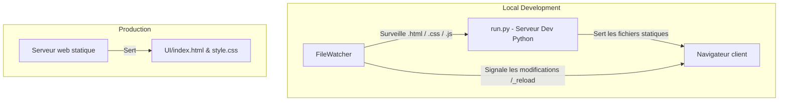

# Micro Solidaire Network — Site Internet


> Projet de création d'une association loi 1901 · Autour de Libourne (Gironde)
> Communauté solidaire de micro-entrepreneur·e·s engagé·e·s pour un numérique responsable et une IA éthique.

---

## À propos

**Micro Solidaire Network** est un projet visant à créer une association qui fédère des micro-entrepreneur·e·s autour d'un **numérique responsable** et d'une **IA éthique**. Ce dépôt contient le **site internet** (landing page) de l'association. 

Conçu selon des principes de sobriété numérique, ce projet est entièrement statique et s'appuie sur une stack légère : **HTML5**, **CSS3** et **JavaScript vanilla** côté client, et un serveur de développement en **Python 3** (bibliothèque standard) côté serveur, garantissant un fonctionnement **sans aucune dépendance externe**.

---

## Architecture du projet

Le projet est conçu de façon minimaliste et découplée :



### Structure des dossiers

```
MicroSolidaireNetwork/
├── run.py                    # Serveur de dev Python (port 4019, auto-reload)
├── requirements.txt          # Prérequis (documente l'absence de dépendances)
├── LICENSE                   # Licence MIT
├── AGENTS.md                 # Consignes pour les agents d'IA
├── llms.txt                  # Index de synthèse pour les IA
├── UI/                       # Répertoire du site servi (landing page)
│   ├── index.html            # Accueil, Activités, Mes besoins, Rejoindre, Contact
│   ├── style.css             # Styles + police Inter via CDN
│   └── assets/img/           # Icônes aquarelles et illustrations de section
├── docs/                     # Documents de conception et chartes graphiques
└── README.md                 # Présentation globale du projet
```

---

## Démarrage rapide

### Prérequis
- **Python 3.8** ou supérieur.
- Aucune installation de dépendance externe n'est requise.

### Lancement du serveur local

Pour lancer le serveur de développement avec rechargement automatique (auto-reload) :

```bash
# Lancer le serveur de développement
python run.py
```

Le script ouvre automatiquement votre navigateur par défaut à l'adresse :
[http://localhost:4019/index.html](http://localhost:4019/index.html)

Pour démarrer sans le rechargement automatique :
```bash
python run.py --no-watch
```

---

## Contribuer

Les contributions sont les bienvenues. Consultez le guide [CONTRIBUTING.md](CONTRIBUTING.md) pour connaître les instructions et les conventions de codage.

---

## Licence

Ce projet est distribué sous licence MIT. Pour plus de détails, consultez le fichier [LICENSE](LICENSE) officiel du dépôt.

```
Copyright (c) 2026 ServOMorph
```

---

## Écosystème

- **SéréniaTech** — Partenaire technique ([serenia-tech.fr](https://serenia-tech.fr))
- **FamiCloud** — Infrastructure de l'espace membres
